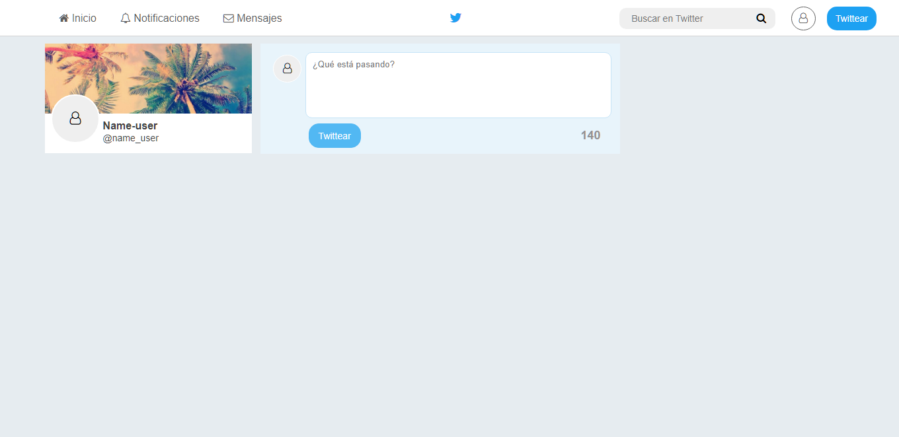

## **RETO DE CÓDIGO -TWITTER**

El reto consiste en replicar una web similar a **Twitter**, como la imagen a continuación :

### **Versiones de la web**

+ **Versión 0.0.1**  
Diseñar un formulario que permita ingresar un texto y un botón para "twittear".
Agregar un evento de click al botón o de submit al formulario.
En el evento, obtener el texto.
Agregar el texto al HTML.

+ **Versión 0.0.2**  
No ingresar texto vacío (deshabilitar el botón de "twittear").
Contar la cantidad de caracteres de forma regresiva.

+ **Versión 0.0.3**  
Si pasa los 140 caracteres, deshabilitar el botón.
Si pasa los 120 caracteres, mostrar el contador con OTRO color.
Si pasa los 130 caracteres, mostrar el contador con OTRO color.
Si pasa los 140 caracteres, mostrar el contador en negativo.

+ **Versión 0.0.4**  
Al presionar enter(/n) que crezca el textarea de acuerdo al tamaño del texto.

+ **Versión 0.0.5 (Extra)**  
Si la cantidad de caracteres ingresados (sin dar un enter), supera al tamaño del textarea por defecto, debe de agregarse una línea más para que no aparezca el scroll. 

### **Detalles del Repositorio**

+ Se encuentra una archivo index.html el cual muestra la estructra inicial con la que se inicializa la página web.

+ Se encuentra un archivo main.css , en el cual se detallan todos los estilos utilizados para el diseño de Twitter. También incluye los estilos agragados mediante el uso de javascrit.

+ Se encuentra un archivo app.js el cual muestra el código utilizado para darle interactividad a la web y poder redactar tweets.

+ La carpeta assets/icons almacena las fuentes de los iconos utilizados en el diseño de la web : [Font-awesome](http://fontawesome.io/ "titulo")

+ La carpeta assets/images almacena la imagen de partada de un usuario utilizada al diseñar la web.